# UI·가독성 개선 결과

휴대폰에서 작던 보조 글자와 조작 영역을 키우고, 예산 요약을 시세·견적 입력보다 앞에 배치했어요.

- 11~12px 보조 글자를 13px 이상으로, 제도 설명 본문과 입력칸은 16px로 맞췄어요.
- 6개 탭은 360px 이상에서 한 줄을 유지해요. 가로 스크롤은 없어요. 320px에서는 탭 안의 문구만 줄바꿈해요.
- 조작 영역은 44px 이상으로 넓혔어요. 체크 동그라미의 보이는 크기는 24px로 유지했어요.
- 예산·하객 요약은 설명과 숫자의 간격을 넓혔어요. 진행 구간·하객 그룹 제목을 스크롤 중에도 볼 수 있어요. 기존 ‘완료한 일 숨기기’를 유지했어요.
- 입력 이름과 고유 `data-fk`를 보완했어요. 선택값 변경 후 포커스, 키보드 탭 이동, Home/End, 동작 줄이기를 검사했어요.
- 중복 하객 검색 마크업을 한 함수로 모으고, 쓰지 않는 색상 변수를 제거했어요.

## 검증

`npm test`: **72개 통과, 실패·건너뜀 0개**. Chromium 151.0.7922.173 / Node 24.19.0에서 확인했어요.

- 9개 시험 × 폭 320·360·390·430px × 라이트·다크.
- 날짜·시간 저장, 엔터로 할 일 추가, 187명 × 62,000원 = 1,159만원, 견적 적용, 하객·축의금 합계, 삭제 표식.
- 카톡 요약 첫 줄, 이름 있는 입력, 고유 포커스 키, 포커스 유지, 300명 검색.
- 전 탭의 가로 넘침 없음, 44px 조작 영역, 문자 대비 4.5:1 이상, 시험 중 콘솔 오류 없음.
- 저장 계층은 원본과 바이트 단위로 동일해요. 고정 콘텐츠 및 법·제도·통계·날짜도 보존 검사를 통과했어요.

## 가정과 한계

로컬 저장과 폼 제출이 금지된 iframe을 검사했어요. 실제 claude.ai 권한·공유 데이터베이스는 연결하지 않았어요. 브라우저 시험은 외부 글꼴 대신 시스템 한글 글꼴을 써요.

Playwright의 Chromium 다운로드는 클라우드 네트워크 정책으로 차단됐어요. 이미 설치된 시스템 Chromium으로 시험을 완료했어요. 원본의 법·제도·통계는 사용자 요청에 따라 바꾸거나 사실 검증하지 않았어요. 확인된 범위 밖 앱 결함은 없어요.

## 전후 화면

390px, 같은 예시 데이터와 날짜(2026-10-06), 같은 탭 위치에서 찍었어요. 원본은 `main:index.html`이에요.

### 진행 순서

| 모드 | 전 | 후 |
|---|---|---|
| 라이트 | 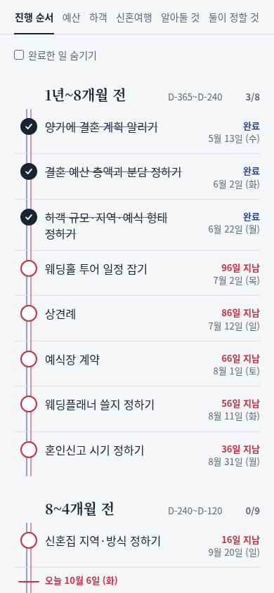 | 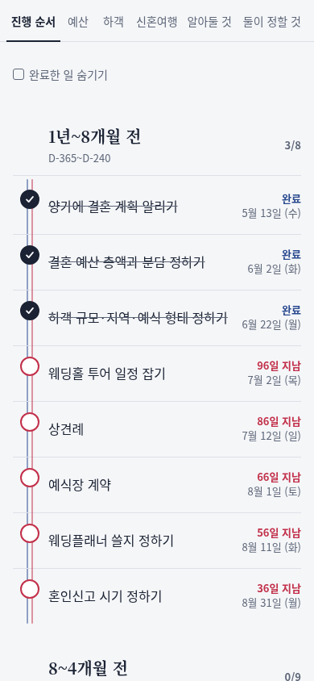 |
| 다크 | 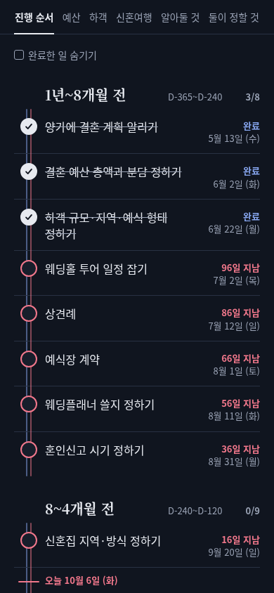 |  |

### 예산

| 모드 | 전 | 후 |
|---|---|---|
| 라이트 | 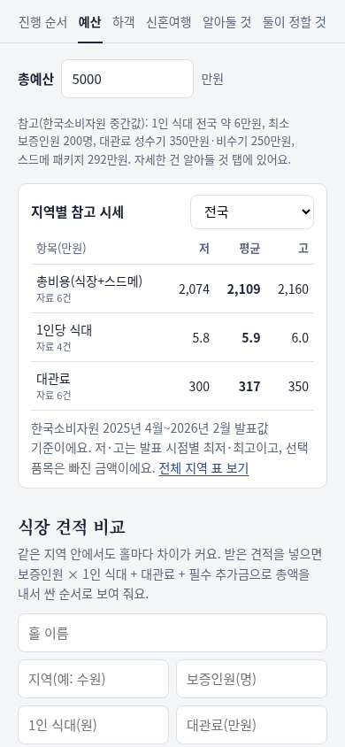 | 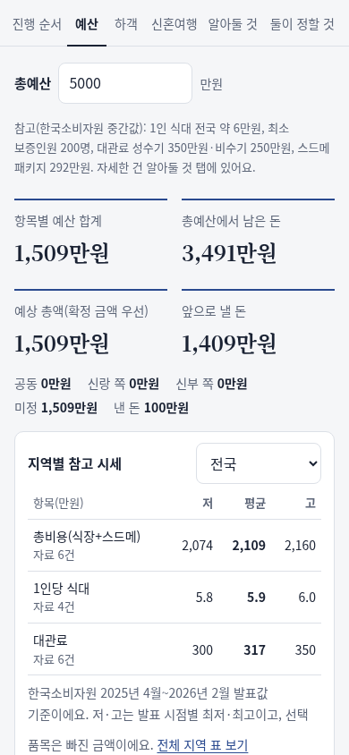 |
| 다크 | 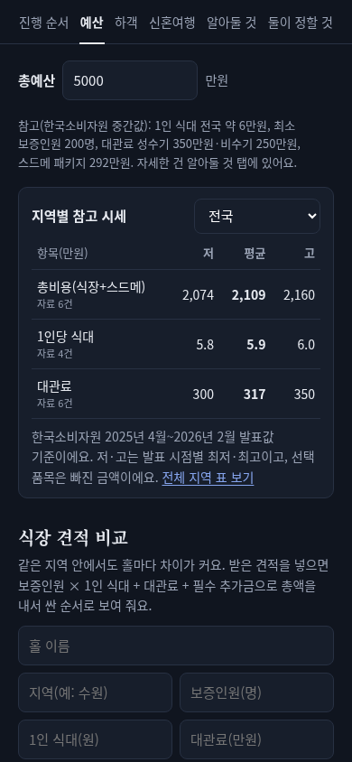 | 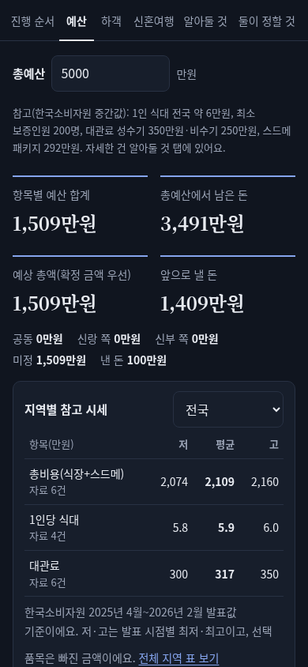 |

### 하객

| 모드 | 전 | 후 |
|---|---|---|
| 라이트 | 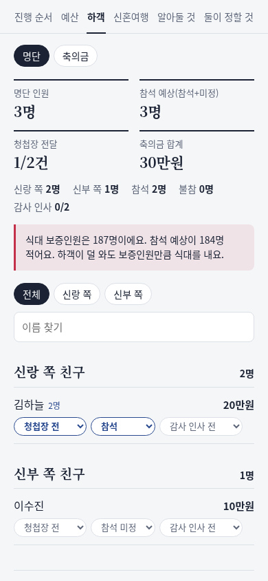 | 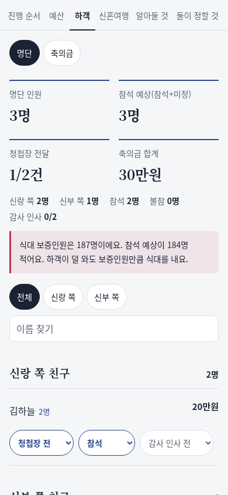 |
| 다크 | 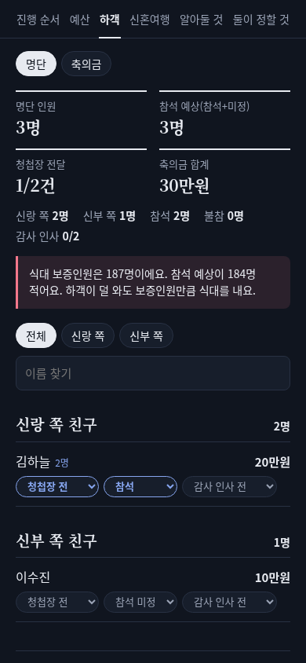 | 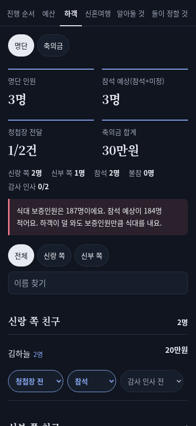 |

### 알아둘 것

| 모드 | 전 | 후 |
|---|---|---|
| 라이트 |  | 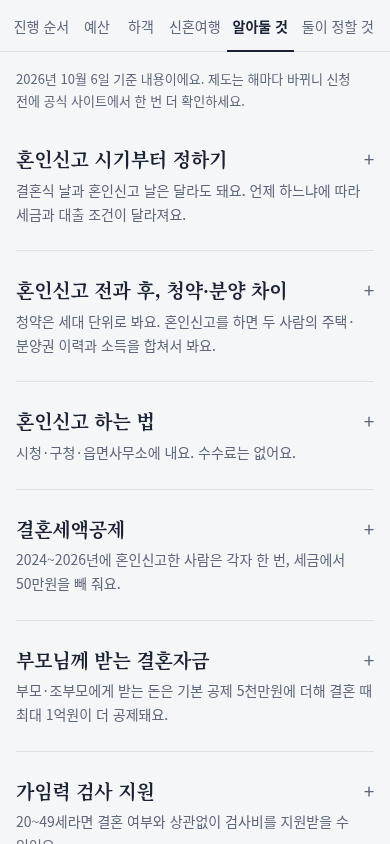 |
| 다크 | 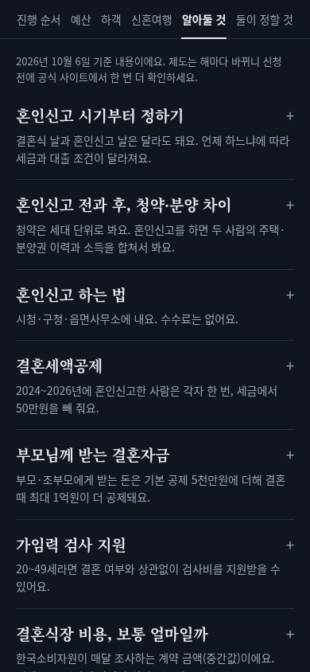 | 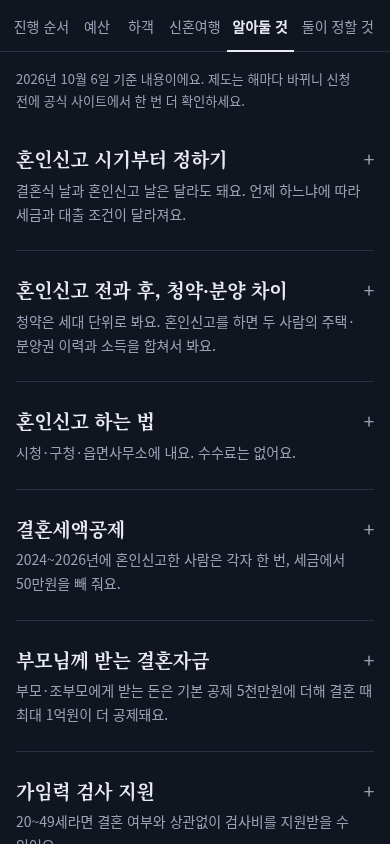 |

